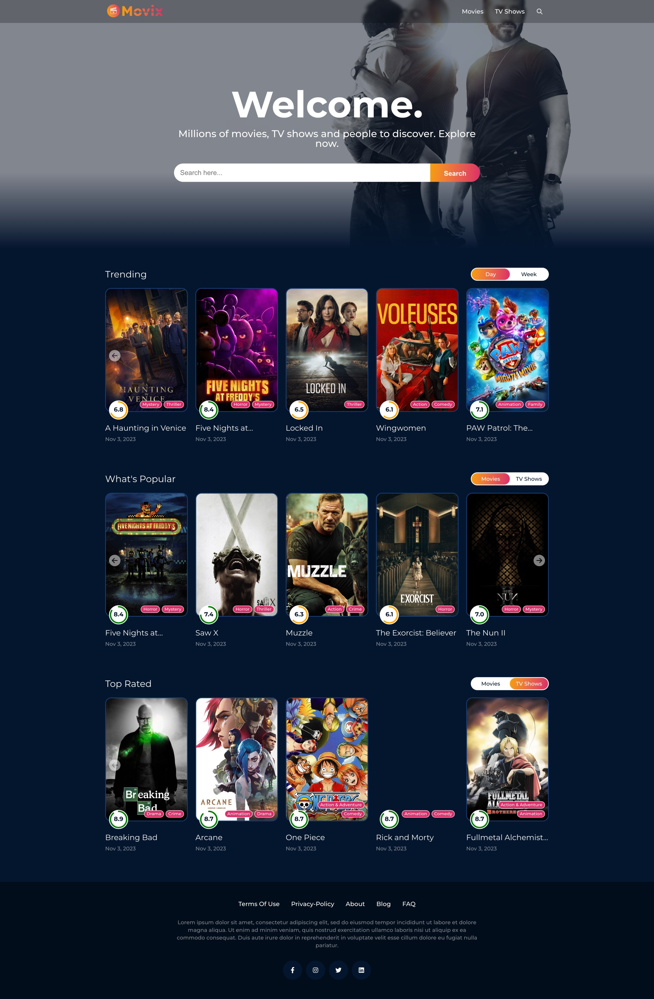

## ReactJS + Redux Toolkit Project Description

This project is built using ReactJS and Redux Toolkit. It uses a custom hook called `useFetch` to fetch data from the API using Axios. It also uses the `useState` hook to track the state of various components, such as the video popup and dropdown menu. Additionally, it uses the `useEffect` hook to fetch data from the API and to update the UI when the state of the application changes.

**Sections:**

* **Hero section:** This section generates a background from the upcoming movies API and selects one randomly.
* **Trending, popular, and top rated section:** This section displays the trending movies and TV shows, as well as the ability to switch between daily and weekly trending. It uses the `useState` hook to track the selected trending type.
* **Details move/tv-show page:** This page displays the main info, genres, writers, director, cast, YouTube videos, and recommended movies for the selected movie or TV show.
* **Skeleton:** This is a placeholder UI that is displayed while the data is being fetched from the API. It uses the `useState` hook to track the loading state of the application and to hide the skeleton when the data is fetched.

**Hooks:**

* **useState:**
    * Track the state of the video popup.
    * Track the state of the dropdown menu.
* **useEffect:**
    * Fetch the upcoming movies API and to select one randomly to generate the background for the Hero section.
    * Fetch the trending movies and TV shows API and to update the carousel when the user switches between daily and weekly trending.

Overall, this project is a good example of how to use ReactJS and Redux Toolkit to build a complex web application. It uses custom hooks, the `useState` hook, and the `useEffect` hook to manage the state of the application and to update the UI in response to user interactions.

[Take a tour here](https://react-redux-movies-app-kappa.vercel.app/)

#### Take a look

